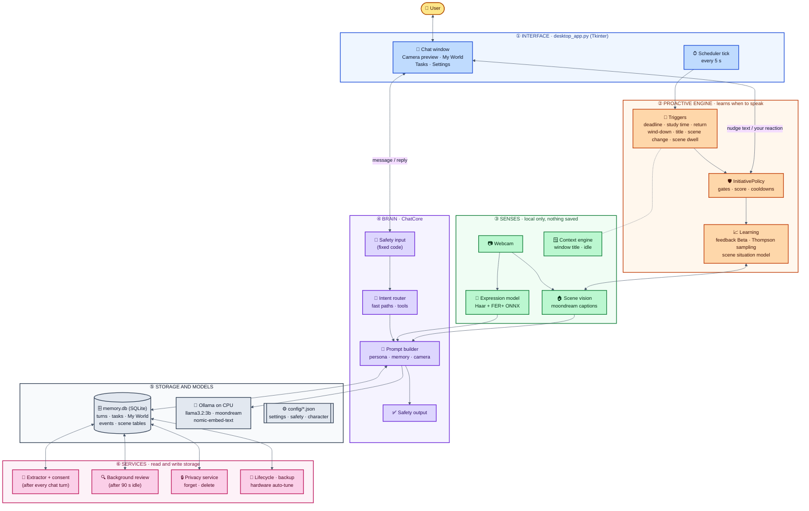
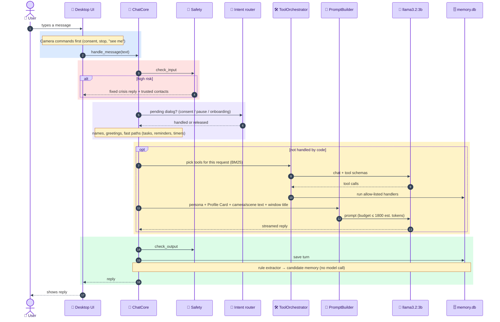
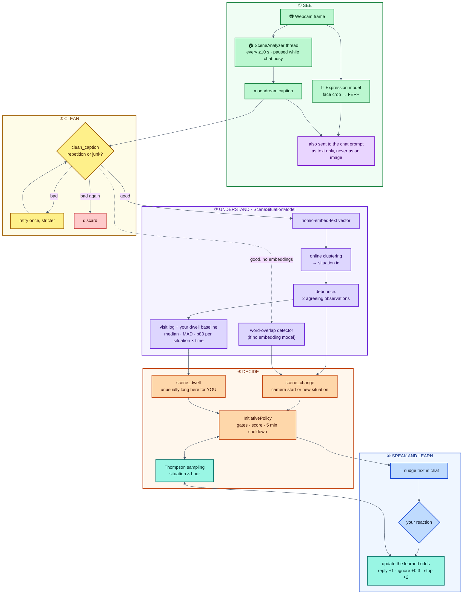

# Study Buddy — architecture (Mermaid source)

Paste each block into https://mermaid.live or any Markdown viewer that supports Mermaid.

## 1_architecture

```mermaid
%%{init: {'theme':'base','flowchart':{'curve':'basis','nodeSpacing':40,'rankSpacing':55,'padding':14},'themeVariables':{'fontFamily':'Segoe UI, Arial','fontSize':'15px','lineColor':'#475569','primaryTextColor':'#0f172a'}}}%%
flowchart TB
  USER(["👤 User"]):::user

  subgraph L1["① INTERFACE  ·  desktop_app.py (Tkinter)"]
    direction LR
    CHATWIN["💬 Chat window<br/>Camera preview · My World<br/>Tasks · Settings"]:::ui
    TICK["⏱ Scheduler tick<br/>every 5 s"]:::ui
  end

  subgraph L2["② PROACTIVE ENGINE  ·  learns when to speak"]
    direction LR
    TRIG["🎯 Triggers<br/>deadline · study time · return<br/>wind-down · title · scene change · scene dwell"]:::pro --> POLICY["🛡 InitiativePolicy<br/>gates · score · cooldowns"]:::pro --> LEARN["📈 Learning<br/>feedback Beta · Thompson sampling<br/>scene situation model"]:::pro
  end

  subgraph L3["③ SENSES  ·  local only, nothing saved"]
    direction LR
    WEBCAM["📷 Webcam"]:::sense --> EXPR["🙂 Expression model<br/>Haar + FER+ ONNX"]:::sense
    WEBCAM --> SCENE["🏠 Scene vision<br/>moondream captions"]:::sense
    CTX["🪟 Context engine<br/>window title · idle"]:::sense
  end

  subgraph L4["④ BRAIN  ·  ChatCore"]
    direction LR
    SAFE["🚨 Safety input<br/>(fixed code)"]:::brain --> ROUTE["🧭 Intent router<br/>fast paths · tools"]:::brain --> PROMPT["🧩 Prompt builder<br/>persona · memory · camera"]:::brain --> OUT["✅ Safety output"]:::brain
  end

  subgraph L5["⑤ STORAGE AND MODELS"]
    direction LR
    DB[("🗄 memory.db (SQLite)<br/>turns · tasks · My World<br/>events · scene tables")]:::store
    OLLAMA["🤖 Ollama on CPU<br/>llama3.2:3b · moondream<br/>nomic-embed-text"]:::store
    CFG[["⚙ config/*.json<br/>settings · safety · character"]]:::store
  end

  subgraph L6["⑥ SERVICES  ·  read and write storage"]
    direction LR
    EXTRACT["📝 Extractor + consent<br/>(after every chat turn)"]:::svc
    REVIEW["🔍 Background review<br/>(after 90 s idle)"]:::svc
    PRIV["🔒 Privacy service<br/>forget · delete"]:::svc
    LIFE["🧹 Lifecycle · backup<br/>hardware auto-tune"]:::svc
  end

  USER <--> CHATWIN
  TICK --> TRIG
  CHATWIN <-- "nudge text / your reaction" --> POLICY
  TRIG -.- CTX
  LEARN <--> SCENE
  CHATWIN <-- "message / reply" --> SAFE
  EXPR --> PROMPT
  SCENE --> PROMPT
  PROMPT --> OLLAMA
  PROMPT <--> DB
  DB <--> EXTRACT
  DB <--> REVIEW
  DB <--> PRIV
  DB <--> LIFE

  classDef user fill:#fde68a,stroke:#b45309,stroke-width:2px,color:#451a03
  classDef ui fill:#bfdbfe,stroke:#1d4ed8,stroke-width:2px,color:#0f172a
  classDef pro fill:#fed7aa,stroke:#c2410c,stroke-width:2px,color:#431407
  classDef sense fill:#bbf7d0,stroke:#15803d,stroke-width:2px,color:#052e16
  classDef brain fill:#ddd6fe,stroke:#6d28d9,stroke-width:2px,color:#2e1065
  classDef store fill:#e2e8f0,stroke:#334155,stroke-width:2px,color:#0f172a
  classDef svc fill:#fbcfe8,stroke:#be185d,stroke-width:2px,color:#500724
  style L1 fill:#eff6ff,stroke:#1d4ed8,stroke-width:2px,color:#1e3a8a
  style L2 fill:#fff7ed,stroke:#c2410c,stroke-width:2px,color:#7c2d12
  style L3 fill:#f0fdf4,stroke:#15803d,stroke-width:2px,color:#14532d
  style L4 fill:#f5f3ff,stroke:#6d28d9,stroke-width:2px,color:#4c1d95
  style L5 fill:#f8fafc,stroke:#334155,stroke-width:2px,color:#0f172a
  style L6 fill:#fdf2f8,stroke:#be185d,stroke-width:2px,color:#831843
```

## 2_chat_turn

```mermaid
%%{init: {'theme':'base','themeVariables':{'fontFamily':'Segoe UI, Arial','fontSize':'15px','actorBkg':'#ddd6fe','actorBorder':'#6d28d9','actorTextColor':'#2e1065','signalColor':'#334155','noteBkgColor':'#fef3c7','noteBorderColor':'#b45309','activationBkgColor':'#e0e7ff','sequenceNumberColor':'#ffffff'}}}%%
sequenceDiagram
  autonumber
  actor U as 👤 User
  participant UI as 💬 Desktop UI
  participant CC as 🧠 ChatCore
  participant SF as 🚨 Safety
  participant IR as 🧭 Intent router
  participant TO as 🛠 ToolOrchestrator
  participant PB as 🧩 PromptBuilder
  participant LL as 🤖 llama3.2:3b
  participant DB as 🗄 memory.db
  U->>UI: types a message
  rect rgb(219,234,254)
    Note over UI: Camera commands first (consent, stop, "see me")
    UI->>CC: handle_message(text)
  end
  rect rgb(254,226,226)
    CC->>SF: check_input
    alt high risk
      SF-->>UI: fixed crisis reply + trusted contacts
    end
  end
  rect rgb(237,233,254)
    CC->>IR: pending dialog? (consent / pause / onboarding)
    IR-->>CC: handled or released
    Note over CC: names, greetings, fast paths (tasks, reminders, timers)
  end
  rect rgb(254,243,199)
    opt not handled by code
      CC->>TO: pick tools for this request (BM25)
      TO->>LL: chat + tool schemas
      LL-->>TO: tool calls
      TO->>DB: run allow-listed handlers
      CC->>PB: persona + Profile Card + camera/scene text + window title
      PB->>LL: prompt (budget ≤ 1800 est. tokens)
      LL-->>CC: streamed reply
    end
  end
  rect rgb(220,252,231)
    CC->>SF: check_output
    CC->>DB: save turn
    Note over CC,DB: rule extractor → candidate memory (no model call)
    CC-->>UI: reply
  end
  UI-->>U: shows reply
```

## 3_camera_proactive

```mermaid
%%{init: {'theme':'base','flowchart':{'curve':'basis','nodeSpacing':35,'rankSpacing':45},'themeVariables':{'fontFamily':'Segoe UI, Arial','fontSize':'15px','lineColor':'#475569'}}}%%
flowchart TB
  subgraph S1["① SEE"]
    direction LR
    CAM["📷 Webcam frame"]:::sense --> SC["🏠 SceneAnalyzer thread<br/>every ≥10 s · paused while chat busy"]:::sense --> V["moondream caption"]:::sense
    CAM --> EX["🙂 Expression model<br/>face crop → FER+"]:::sense
    EX --> CTXT["also sent to the chat prompt<br/>as text only, never as an image"]:::brain
    V --> CTXT
  end
  subgraph S2["② CLEAN"]
    direction LR
    CL{"clean_caption<br/>repetition or junk?"}:::filter
    RETRY["retry once, stricter"]:::filter
    DROP["discard"]:::bad
    CL -->|bad| RETRY --> CL
    CL -->|bad again| DROP
  end
  subgraph S3["③ UNDERSTAND  ·  SceneSituationModel"]
    direction LR
    EMB["nomic-embed-text vector"]:::model --> CLU["online clustering<br/>→ situation id"]:::model --> DEB["debounce:<br/>2 agreeing observations"]:::model --> VIS["visit log + your dwell baseline<br/>median · MAD · p80 per situation × time"]:::model
    LEX["word-overlap detector<br/>(if no embedding model)"]:::model
  end
  subgraph S4["④ DECIDE"]
    direction LR
    CHG["scene_change<br/>camera start or new situation"]:::pro
    DW["scene_dwell<br/>unusually long here for YOU"]:::pro
    POL["InitiativePolicy<br/>gates · score · 5 min cooldown"]:::pro
    TS["Thompson sampling<br/>situation × hour"]:::learn
    CHG --> POL
    DW --> POL
    POL <--> TS
  end
  subgraph S5["⑤ SPEAK AND LEARN"]
    direction LR
    MSG["💬 nudge text in chat"]:::ui --> OUT{"your reaction"}:::ui --> UPD["update the learned odds<br/>reply +1 · ignore +0.3 · stop +2"]:::learn
  end

  V --> CL
  CL -->|good| EMB
  CL -.->|good, no embeddings| LEX
  DEB --> CHG
  LEX --> CHG
  VIS --> DW
  POL --> MSG
  TS <--> UPD

  classDef sense fill:#bbf7d0,stroke:#15803d,stroke-width:2px,color:#052e16
  classDef filter fill:#fef08a,stroke:#a16207,stroke-width:2px,color:#422006
  classDef model fill:#ddd6fe,stroke:#6d28d9,stroke-width:2px,color:#2e1065
  classDef pro fill:#fed7aa,stroke:#c2410c,stroke-width:2px,color:#431407
  classDef learn fill:#99f6e4,stroke:#0f766e,stroke-width:2px,color:#042f2e
  classDef ui fill:#bfdbfe,stroke:#1d4ed8,stroke-width:2px,color:#0f172a
  classDef bad fill:#fecaca,stroke:#b91c1c,stroke-width:2px,color:#450a0a
  classDef brain fill:#e9d5ff,stroke:#7e22ce,stroke-width:2px,color:#3b0764
  style S1 fill:#f0fdf4,stroke:#15803d,stroke-width:2px,color:#14532d
  style S2 fill:#fefce8,stroke:#a16207,stroke-width:2px,color:#713f12
  style S3 fill:#f5f3ff,stroke:#6d28d9,stroke-width:2px,color:#4c1d95
  style S4 fill:#fff7ed,stroke:#c2410c,stroke-width:2px,color:#7c2d12
  style S5 fill:#eff6ff,stroke:#1d4ed8,stroke-width:2px,color:#1e3a8a
```
